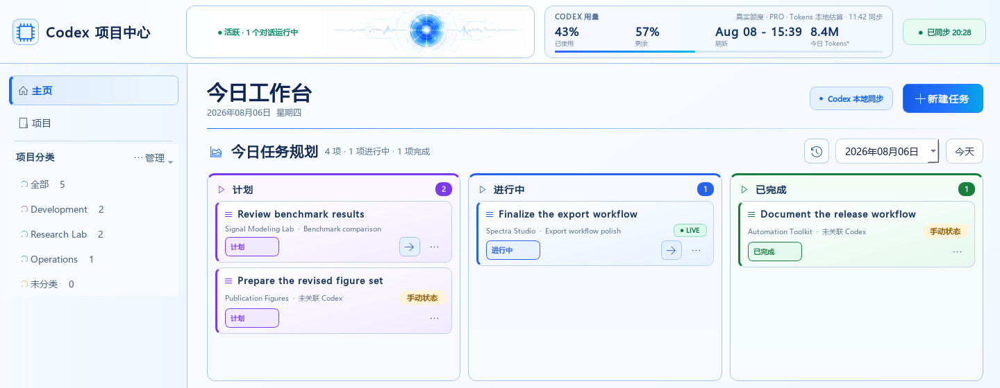
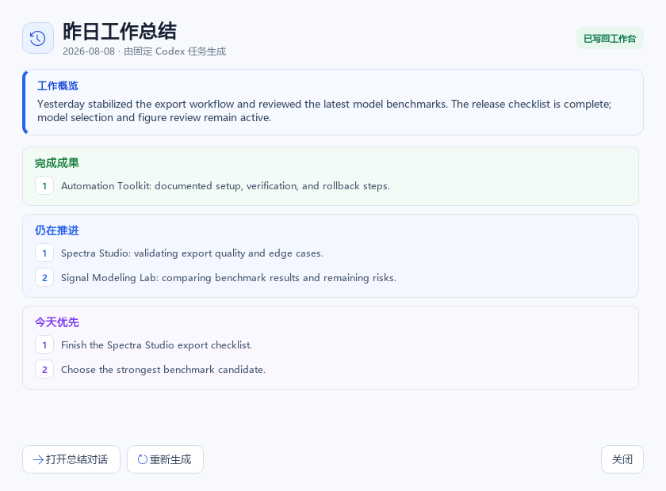
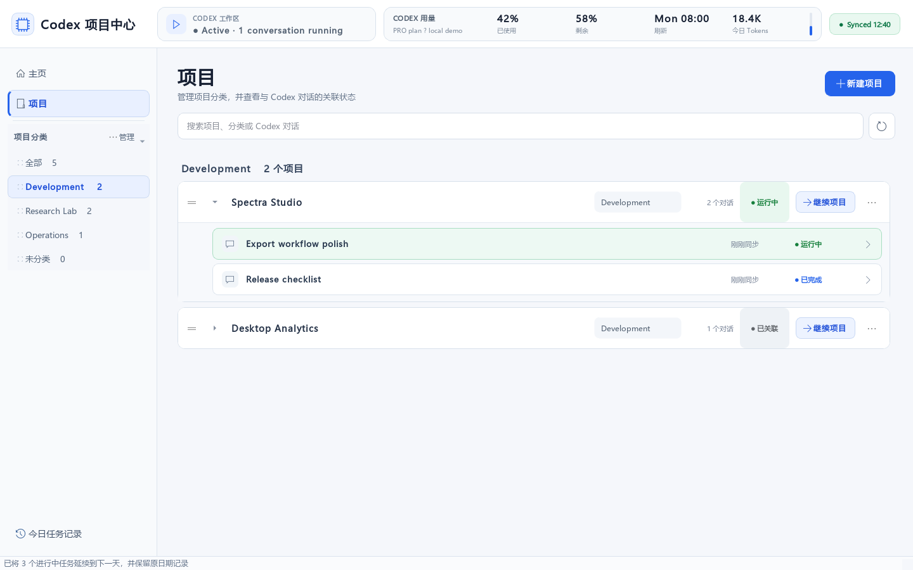
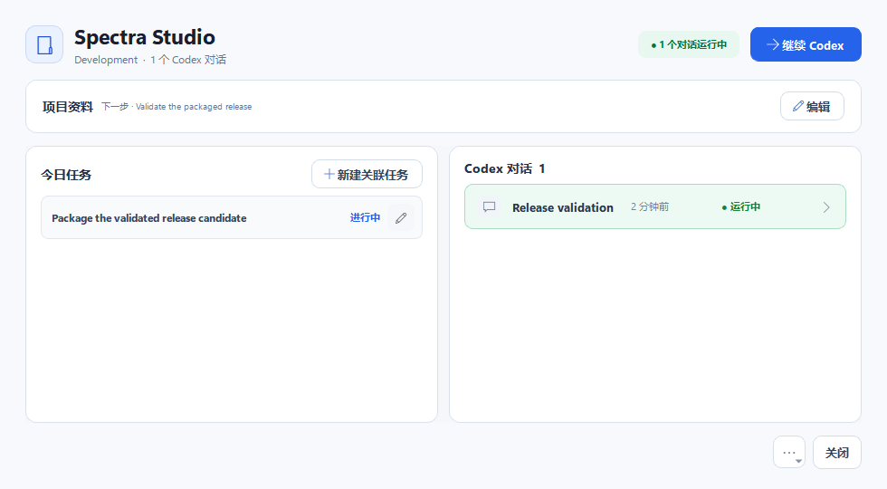
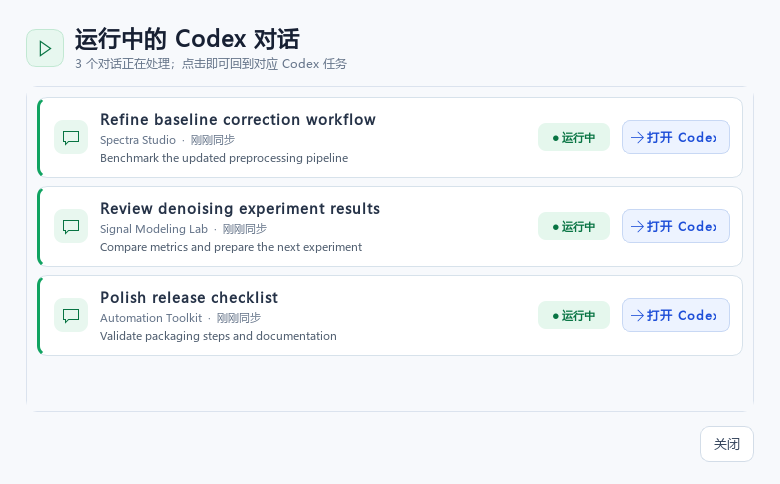

# Codex Project Hub

A local Windows desktop companion for organizing Codex projects, conversations, and daily tasks.

Codex remains the main interface for conversation and execution. This application provides project classification, task planning, status monitoring, and direct links back to the corresponding Codex conversation.

## Screenshots

### Daily tasks



### Daily review



### Projects and conversations



### Project workbench



### Running conversations



All screenshots use fictional sample data. They do not contain real project paths, account information, or Codex conversation IDs.

## Features

### Project management

- Organize work as **category → project → Codex conversation**.
- Create, edit, archive, restore, and reorder projects.
- Create, rename, delete, and reorder categories.
- Move projects between categories.
- Define a project objective, management priority, lifecycle state, execution stage, health, blocker, and concrete next action.
- Use the portfolio cockpit to surface explicitly blocked or attention-needed projects without treating incomplete legacy metadata as a warning.
- Separate **strategic focus** from **actual execution**: the former is a deliberate portfolio decision, while the latter is detected from today's in-progress tasks and running Codex conversations.
- Keep a configurable one-to-nine-project focus capacity. The home decision queue shows focus usage and real parallel work together, while a dedicated calibration panel can promote or demote projects without silently changing priorities; every change enters the normal project-decision audit trail.
- Surface a compact home decision queue for focus capacity, confirmed risk or blockage, neutral review reminders, and missing-next-action projects; every card opens the exact decision flow, and review debt is never presented as operational risk.
- Detect quiet active projects from their latest task transition, Codex activity, or deliberate review. A separate, neutral lifecycle queue can confirm the project remains active, pause it without deleting anything, defer the decision, or open the full workbench; inactivity never changes status automatically and is never labelled as project risk.
- Keep task links stable when Codex refreshes a project's current identifier.
- Promote a project's concrete next action into today's plan with one click, with duplicate protection and automatic handoff back to the next project decision when the task is completed.
- Detect when today's in-progress work diverges from the project's declared next action without mislabelling the difference as risk. A guided reconciliation queue can adopt the live task as the new project direction—binding its completion to the next project handoff—or explicitly retain the existing direction; both choices remain human-controlled and auditable, and the reminder returns only when the underlying work changes again.
- Ask Codex to inspect a project in read-only, ephemeral mode and suggest its objective, stage, health, blocker, and next action; suggestions remain editable and require confirmation before saving.
- Run a portfolio-wide Codex governance pass over selected projects with missing decisions. Analysis is sequential and read-only, every proposed field is reviewed before application, existing human decisions are never overwritten, and gaps are rechecked at write time to reject stale suggestions.
- Open a single project workbench for decisions, today's tasks, local files, and Codex conversations.
- Keep a local, source-labelled history of real project-decision changes, including manual edits, Codex suggestions, category moves, and completed next-action handoffs.
- Confirm a project's current state without inventing a field change. Reviews are audited, use a 3/7/14-day cadence for focus/normal/later priorities, and re-enter a neutral review queue when due.
- Process that review queue one project at a time from the home workspace: inspect the saved objective, stage, health, cadence, and next action; confirm deliberately, defer without mutating data, or open the full project workbench to correct the decision first.
- Treat unverified legacy attention flags as **Needs Review**, not as current risk; only a confirmed attention decision is surfaced as a live portfolio warning.
- Track each blocker from first confirmation through resolution. Editing the reason keeps the original clock, project views show the live duration, a one-click resolution action restores normal health, and the resolved blocker plus timestamp remain available for audit and daily review evidence.
- Restore any recorded project decision selectively: only fields touched by that event are rolled back, newer conflicting edits are disclosed before confirmation, and the rollback is preserved as a new audit event.
- Use a recoverable project archive for both Codex-synchronized and manually created projects, preserving management metadata, category placement, local files, and conversation links. Every new archive and restore action enters the unified decision history with its timestamp and a frozen snapshot of project status, stage, next action, blocker, and confirmed closeout outcome; the archive shows cycle counts while legacy records remain honestly marked as time unknown. Projects with unfinished tasks or running Codex conversations must close that live work first, preventing archived projects from leaving orphaned activity records.
- Close a project with an explicit, human-confirmed delivery outcome instead of a status flag alone. The closeout stores the original completion time, supports outcome revisions, appears in the project workbench and handoff context, and enters the unified audit history. Reopening retires the current completion claim while preserving the previous outcome as historical evidence.
- Enforce coherent project decisions: blockers control health automatically, completed projects close their execution fields, linked open tasks remain untouched for deliberate follow-up, and completed projects cannot schedule new work until they are reopened.
- Search projects by name, category, path, objective, next action, conversation title, or conversation summary.
- Filter the portfolio by strategic focus or actual live execution, missing next action, or paused/idea state.
- Filter projects by running, completed, linked, or unlinked state.
- Expand a project to view its linked Codex conversations.
- Continue a project by copying its handoff context and opening the running or most recent Codex conversation.

Archiving a project removes it from the active portfolio without deleting its management record, folder, or Codex conversations. Archived projects can be restored from the project page.

### Daily tasks

- Create tasks for any date.
- Associate a task with a category, project, and optional Codex conversation.
- Use three task states: **Planned**, **In Progress**, and **Completed**.
- Create a task directly in any board column with that state preselected.
- Drag a task by its handle to prioritize it within a column or move it between Planned, In Progress, and Completed; the saved order survives refreshes and restarts, while the status selector remains an accessible fallback.
- Use a configurable soft WIP limit for in-progress tasks. The board shows capacity directly in the column header, never blocks a legitimate manual or Codex transition, and opens a focused review that can move idle work back to Planned while protecting tasks whose Codex conversations are still running.
- Undo a recent manual status move from the status bar; reopening a completed project-next-action task restores the project handoff unless a newer next action already exists.
- Automatically move a linked task to **In Progress** when Codex starts working on its conversation.
- Keep a daily activity record.
- Record every real task-state transition with its source—manual selection, Kanban drag, task editing, Codex auto-start, project handoff, or daily rollover—and feed that evidence into daily reviews.
- Record a concise, verifiable completion outcome after a task is finished. Outcomes keep their own revision history, appear compactly on completed cards, feed Codex daily reviews as stronger evidence than planning notes, and follow project-next-action handoffs back into the project workbench.
- Open a read-only task record from the board, daily history, or recycle bin to inspect planning notes, source-labelled status transitions, the current completion outcome, and every outcome revision. Reopened tasks keep retired outcomes clearly historical instead of presenting them as current evidence.
- Move unwanted tasks to a recoverable recycle bin instead of deleting their daily record; archived tasks retain their original date, three-state status, ordering context, and complete transition history while remaining excluded from boards, workload counts, and generated reviews.
- Carry unfinished in-progress tasks to the next day while preserving previous records.
- Automatically summarize the previous day's tasks through a user-configured fixed Codex conversation.
- Include audited project reviews, direction reconciliations, closeouts, and real objective/stage/health/next-action changes in the daily evidence packet. Management decisions are counted separately from tasks and conversations; only a human-confirmed project closeout is accepted as project-level completion evidence.
- Keep the home review compact and open the full completed / in-progress / next-focus breakdown on click.
- Show immediate progress and failure feedback when a review is regenerated, then write the structured result back into the workspace.

### Codex integration

- Read active, non-archived user conversations from the local Codex state.
- Exclude Codex subagent and guardian threads from the project list.
- Match conversations to projects using Codex metadata and working-directory paths.
- Display the saved Codex conversation title and current run state.
- Click the global workspace status to inspect every running conversation and open it in Codex.
- Open a conversation with the `codex://threads/<id>` desktop deep link.
- Show running, completed, and linked states.
- Read Codex quota usage and reset time.
- Estimate current-day tokens from local session logs when the official daily bucket is delayed.
- Generate the previous day's review through a configured Codex conversation and store its structured response locally.
- Send manual regeneration requests visibly through Codex Desktop, then write the reply back into the dashboard.
- Include completed work, active work, and concrete next-step evolution suggestions in every review.
- Treat a human-recorded task outcome as primary completion evidence while keeping plans and notes clearly separated from actual results.
- Combine dated planning records with every user Codex conversation that was actually active that day, using per-record timestamps instead of a conversation's latest-modified date.
- Show the number of covered work items, planning tasks, Codex conversations, and user turns before the review.

The application reads Codex metadata and session activity. It never edits Codex databases directly. The optional daily-summary feature sends one prompt to the conversation ID configured by the user.

## Requirements

- Windows 10 or Windows 11
- Python 3.10 or newer
- PyQt5 5.15
- Codex Desktop for conversation synchronization and deep links
- A current Codex CLI installation for automatic background daily summaries
- A running Codex Desktop window for visible manual regeneration

## Installation

```powershell
git clone https://github.com/jqhu2025/CodexProjectHub.git
cd CodexProjectHub

py -3 -m venv .venv
.\.venv\Scripts\Activate.ps1
python -m pip install --upgrade pip
python -m pip install -r requirements.txt
```

## Run

Double-click `启动项目中心.cmd`, or run:

```powershell
python app_qt.pyw
```

The Windows launcher uses `pythonw.exe` when available so the application can run without an additional console window.

If Codex is installed in a custom location, set `CODEX_EXECUTABLE` before launching:

```powershell
$env:CODEX_EXECUTABLE = "C:\path\to\codex.exe"
python app_qt.pyw
```

### Configure the fixed daily-summary conversation

Copy the local settings template and place the ID of the Codex conversation that should generate daily reviews:

```powershell
Copy-Item data\settings.example.json data\settings.json
```

```json
{
  "dailySummaryThreadId": "your-codex-thread-id",
  "portfolioFocusCapacity": 3,
  "portfolioInactivityDays": 14,
  "taskWipLimit": 3
}
```

The conversation ID can also be provided through `CODEX_HUB_SUMMARY_THREAD_ID`. Runtime settings and generated summaries are ignored by Git.

## Sample data

The repository does not include personal runtime data. To load the fictional data used in the screenshots:

```powershell
Copy-Item data\categories.example.json data\categories.json
Copy-Item data\projects.example.json data\projects.json
Copy-Item data\project_layout.example.json data\project_layout.json
Copy-Item data\project_decisions.example.json data\project_decisions.json
Copy-Item data\today_tasks.example.json data\today_tasks.json
Copy-Item data\settings.example.json data\settings.json
```

The sample project paths do not need to exist unless you use the **Open Folder** action.

## Task and conversation states

| State | Description |
| --- | --- |
| Running | Codex is currently processing the linked conversation. |
| Completed | The latest Codex run has stopped or completed. |
| Linked | The conversation belongs to the project but is not currently running. |

## Local data and privacy

Runtime data is stored in the `data` directory:

| File | Contents |
| --- | --- |
| `data/projects.json` | Project names, categories, local paths, and status. |
| `data/categories.json` | Custom category names and order. |
| `data/today_tasks.json` | Daily tasks and optional conversation references. |
| `data/daily_summaries.json` | Codex-generated reviews for previous workdays. |
| `data/settings.json` | Local configuration, including the optional summary conversation ID, strategic-focus capacity, active-portfolio inactivity threshold, and daily task WIP limit. |
| `data/project_layout.json` | Project order and recoverable archive settings. |
| `data/project_decisions.json` | Local audit trail for real objective, stage, health, blocker, category, next-action, lifecycle, and project-closeout events. |

These files may contain local paths or Codex conversation IDs and are excluded by `.gitignore`. Only fictional `*.example.json` files are committed.

The application does not start a web server or listen on a network port. When daily summaries are enabled, the previous day's task packet is sent to the user-selected Codex conversation; other runtime data remains local.

## Project structure

```text
CodexProjectHub/
├─ app_qt.pyw
├─ assets/
├─ codex_hub/
│  ├─ management.py
│  ├─ runtime.py
│  └─ desktop_bridge.py
├─ data/
├─ docs/images/
├─ tests/
├─ requirements.txt
└─ 启动项目中心.cmd
```

## Development

Check the Python source before committing changes:

```powershell
python -m py_compile app_qt.pyw
python -m unittest discover -s tests -v
```

Project decisions, task transitions, daily rollover, and next-action handoffs are isolated in the Qt-independent `codex_hub/management.py` domain module. Codex session discovery and state classification live in `codex_hub/runtime.py`; unchanged session-log tails are cached, and periodic refreshes use indexed user threads instead of recursively scanning the complete Codex session directory. Desktop deep-link handling is separated in `codex_hub/desktop_bridge.py`.

The application currently targets Windows and the local storage format used by Codex Desktop. A Codex update may require adjustments to the local metadata readers.

## License

No open-source license has been selected. The repository is all-rights-reserved unless a license file is added.
