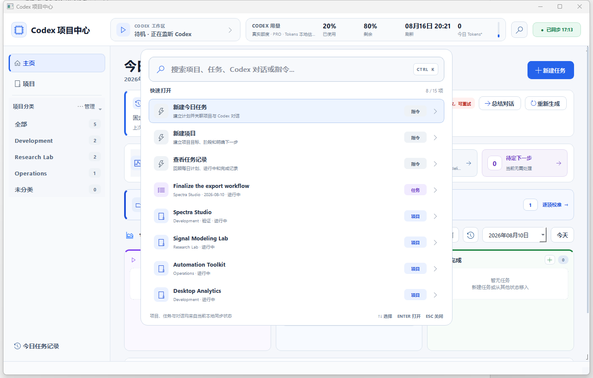

# Codex Project Hub


A local-first Windows desktop companion for organizing Codex projects, conversations, and daily work.

Codex stays the primary place for prompting and execution. Codex Project Hub adds a lightweight overview around it: organize projects, see which conversations are active, plan today's work, and jump back to the exact Codex conversation when it is time to continue.


> All screenshots use fictional sample data. The repository does not contain real project paths, account information, or Codex conversation IDs.

## Highlights

- **Project hierarchy** — organize work as category → project → Codex conversation.
- **Daily task board** — plan, start, complete, reorder, and carry unfinished work forward without losing history.
- **Live Codex state** — show conversations as running, completed, or linked from local Codex activity.
- **Direct return to Codex** — open the corresponding conversation through the Codex desktop deep link.
- **Automatic task progress** — move a linked task to In Progress when Codex starts processing its conversation.
- **Daily review** — optionally ask a fixed Codex conversation to summarize yesterday's completed work, active work, and recommended next steps.
- **Quick open** — press `Ctrl+K` to search projects, tasks, conversations, and common actions.
- **Local storage** — keep project metadata and task history on the current machine; no web server is started.

## Screenshots

### Project overview

Projects are grouped by category. Each row shows its Codex conversation count and current state without expanding every conversation on the main page.


### Project workbench

Open a project to see today's linked tasks, its next action, and the associated Codex conversations in one compact view.


<details>
<summary>More screenshots</summary>

### Quick open



### Running Codex conversations


### Codex-generated daily review


</details>

## How it works

1. The application reads the local Codex project and conversation metadata available on the machine.
2. Conversations are matched to projects using Codex project metadata and working-directory paths.
3. Recent session events are used to classify each conversation as **Running**, **Completed**, or **Linked**.
4. Daily tasks can be associated with a category, project, and optional Codex conversation.
5. Selecting **Open Codex** returns to the existing conversation instead of creating a second execution interface.

Codex Project Hub does not edit Codex databases or conversation logs. Its own data is stored separately in local JSON files.

## Requirements

- Windows 10 or Windows 11
- Python 3.10 or newer
- Codex Desktop
- A current Codex CLI installation if automatic daily reviews are enabled

## Quick start

```powershell
git clone https://github.com/jqhu2025/CodexProjectHub.git
cd CodexProjectHub

py -3 -m venv .venv
.\.venv\Scripts\Activate.ps1
python -m pip install --upgrade pip
python -m pip install -r requirements.txt
python app_qt.pyw
```

On Windows, you can also double-click `启动项目中心.cmd`. The launcher uses `pythonw.exe` when available, so the application runs without a console window.

If Codex is installed in a custom location:

```powershell
$env:CODEX_EXECUTABLE = "C:\path\to\codex.exe"
python app_qt.pyw
```

## Optional daily review

Codex Project Hub can send the previous day's task and activity summary to one user-selected Codex conversation. Copy the settings template:

```powershell
Copy-Item data\settings.example.json data\settings.json
```

Then add the conversation ID:

```json
{
  "dailySummaryThreadId": "your-codex-thread-id"
}
```

The same value can be supplied through the `CODEX_HUB_SUMMARY_THREAD_ID` environment variable. Generated summaries and local settings are ignored by Git.

## Sample data

The repository includes fictional examples for trying the interface without using personal project data:

```powershell
Copy-Item data\categories.example.json data\categories.json
Copy-Item data\projects.example.json data\projects.json
Copy-Item data\project_layout.example.json data\project_layout.json
Copy-Item data\project_decisions.example.json data\project_decisions.json
Copy-Item data\today_tasks.example.json data\today_tasks.json
Copy-Item data\settings.example.json data\settings.json
```

The sample folder paths do not need to exist unless you use an action that opens or inspects the project folder.

## Local data and privacy

Runtime files are stored in `data/` and excluded from version control:

| File | Purpose |
| --- | --- |
| `projects.json` | Project names, categories, paths, and optional project notes |
| `categories.json` | Category names and display order |
| `today_tasks.json` | Dated tasks, states, history, and optional Codex links |
| `daily_summaries.json` | Structured Codex-generated daily reviews |
| `project_layout.json` | Project ordering and archive state |
| `project_decisions.json` | Local history of confirmed project changes |
| `settings.json` | Local application configuration |

Important privacy behavior:

- Personal runtime JSON files are ignored by Git; only `*.example.json` files are committed.
- Previous valid JSON versions are kept under `data/.backups` for local recovery.
- The application does not start a server or listen on a network port.
- Codex state and conversation logs are read only.
- When daily review is enabled, only the prepared review packet is sent to the configured Codex conversation.

## Project structure

```text
CodexProjectHub/
├─ app_qt.pyw                 # PyQt5 application
├─ codex_hub/
│  ├─ management.py          # Project and task state rules
│  ├─ navigation.py          # Ctrl+K search catalog and ranking
│  ├─ portfolio.py           # Project/task association logic
│  ├─ runtime.py             # Local Codex conversation discovery
│  ├─ usage.py               # Quota and local token telemetry
│  ├─ desktop_bridge.py      # Codex Desktop integration
│  └─ storage.py             # Atomic JSON persistence and recovery
├─ data/                     # Local runtime data and examples
├─ docs/images/              # Privacy-safe screenshots
├─ tests/                    # Automated tests
├─ requirements.txt
└─ 启动项目中心.cmd
```

## Development

Run the test suite before submitting changes:

```powershell
python -m py_compile app_qt.pyw
python -m unittest discover -s tests -v
```

The domain logic under `codex_hub/` has no Qt dependency where practical, making project state, task transitions, storage recovery, search ranking, and Codex runtime classification independently testable.

## Current limitations

- Windows only.
- Depends on the local metadata format used by Codex Desktop; a future Codex update may require reader changes.
- Daily review requires a configured Codex conversation and an available Codex CLI.
- This repository currently has no packaged installer or signed release binary.

## License

No open-source license has been selected. Unless a license is added, all rights are reserved.
